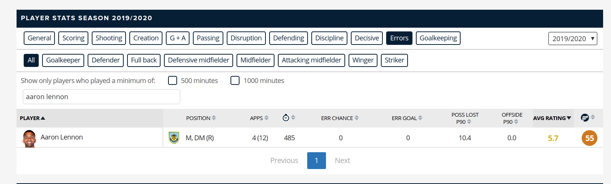

# FIFA data

For an assignment, we will be working with two datasets on football players:

1. Player ratings from the FIFA 19 video game
2. Player statistics from the 2019-2020 season of the English Premier League

## FIFA 19 Data

The FIFA 19 data was accessed via kaggle at the following url: https://www.kaggle.com/karangadiya/fifa19?select=data.csv

We downloaded the data and placed it in a file `fifa_data.csv`

The data is licensed under the CC BY-NC-SA 4.0 license, which we have also included here under the file: `cc_by_nc_sa4.txt`

## Player Statistics

The second dataset will be scraped/collected from the website: https://www.footballcritic.com/premier-league/season-2019-2020/player-stats/2/21558#errors

On that website, the data is organized into an HTML table

The original source data is fetched from a single HTTP request, that is then processed and formatted into a table via some javascript code

The source data has the following shape:

```json
[
  [
    [
      "33",
      "55",
      "Aaron Lennon",
      "England",
      "https://www.sportsbase.io/images/people/63.png",
      "Burnley",
      "https://www.sportsbase.io/images/clubs/492.png",
      "492",
      "Burnley FC",
      "68",
      "England",
      XXXXXXXXXXXXXXXXXXXXXXXX MANY MORE ENTRIES
    ]
  ]
]
```

For the discussion below, assume that this data was all loaded into a variable named `data`

In javascript the square brackets define an array -- similar in notation and use to Python lists

Notice that data begins by opening three arrays.

We'll discuss each "level" of these arrays in turn:

1. The first array/list has only one element. It is accessed in python or javascript as `data[0]`. All the actual data is contained in `data[0]`
2. The second level has 501 elements. Each element contains data for a single player. For example `data[0][0]` contains data for the player Aaron Lennon
3. The third level has 106 entries, each containing a specific statistic or attribute belonging to that player. For example `data[0][0][2]` contains the text `"Aaron Lennon"`, which is how we knew `data[0][0]` contained the data for this player

Our task is to determine a mapping from the columns listed in the website to one of the

We can do this by examining how the javascript code unpacks the `data` object into the nicely formatted/named columns in the website table

The core javscript code for unpacking `data` can be found in `unpacking-code.js`

We'll learn how to reverse enginner this unpacking code via an example

First, on the website click the button above the table that says "Errors"

You should see the column names have changed to what is below in the image (note that in the image I have also searched for "Aaron Lennon", which is one only one row appears in the table)



There are a few columns that appear for all selections of the "statistic group" at the top. These are the first 4 (player, position, apps (appearances), and the stopwatch symbol (minutes)) as well as the last 2 (Avg Rating and the final one with a symbol).

The columns in between are specific to the statistic group

In the image above, there are four such columns and they are named `["ErrChance", "ErrGoal", "PossLostP90", "OffsideP90"]`

Keep this in mind...

Next, we'll turn to the `unpacking-code.js` code.

We've repeated a snippet of this code below for discussion purposes

```js
// 1.
for (i = 0; i < data[0].length; i++) {
  // 2.
  if (
    data[0][i][17] >= minutesPlayed &&
    (posNr == 0 || posNr == data[0][i][87])
  ) {
    // 3
    h = data[0][i];
    //console.log(h);

    // MORE CODE HERE!!!!!

    // 4.
    r += '<td class="cr Errors">' + checkEmptyRound(h[64]) + "</td>";
    r += '<td class="cr Errors">' + checkEmptyRound(h[61]) + "</td>";
    r += '<td class="cr Errors">' + checkEmpty(h[59]) + "</td>";
    r += '<td class="cr Errors">' + checkEmpty(h[40]) + "</td>";

    // MORE CODE HERE!!!!!
  }
}
```

Notice that we have added 4 numbered comments. We'll discuss them in turn to understand what they do

1. Creates a loop over the dataset. In python this might look like `for i in range(len(data[0])):`
2. Checks to see if the player had at least a minimum number of minutes played. Also checks a few other things, I'm not sure what these are
3. Inside the if, block the line `h = data[0][i]` extracts the data for the `i`th player and stores the 106 element array of statistics in a variable named `h`
4. Unpacks all the data from `h` related to the `Errors` section of stats

The 4th step is the crucial one here. It provides us a mapping from the array of 106 player values (the `h` variables) to the columns listed on the website.

In this case the mapping says that `h[64]` corresponds to the `"ErrChance"` variable for our player

We'll list the full set of mappings for the "Errors" variables as a python dictionary:

```python
column_map = {
    64: "ErrChance",
    61: "ErrGoal",
    59: "PossLostP90",
    40: "OffsideP90"
}
```

### Goal

The WANT for this task is to construct a csv file containing player stats for the 2019-2020 EPL season

We'll do this via a few steps:

1. Load the raw `data` variable into python
2. Construct a mapping for each stat group by following these steps:
   - Click on the stat group on the website
   - Notice the number of stat-group specific columns (in our Errors example this was 4)
   - Make note of the column names
   - Find the corresponding section in the `unpacking-code.js` that handles this stat-group's data
   - Record the mapping between the integer index into `h` and the column name
3. Apply the mapping to the entire dataset to construct a pandas dataframe
4. Save the DataFrame as a csv file

We have included starter code in the file `unpack_epl_stats.py`

This includes steps 1, 3, and 4; but has not yet finished step 2

The assignment with this dataset is to complete step 2 to construct the full mapping from indices of `h` to column names from the website
